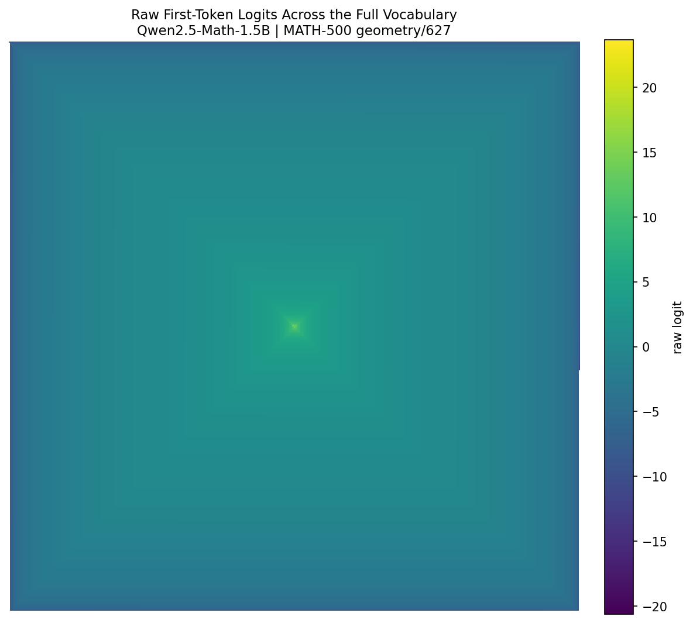
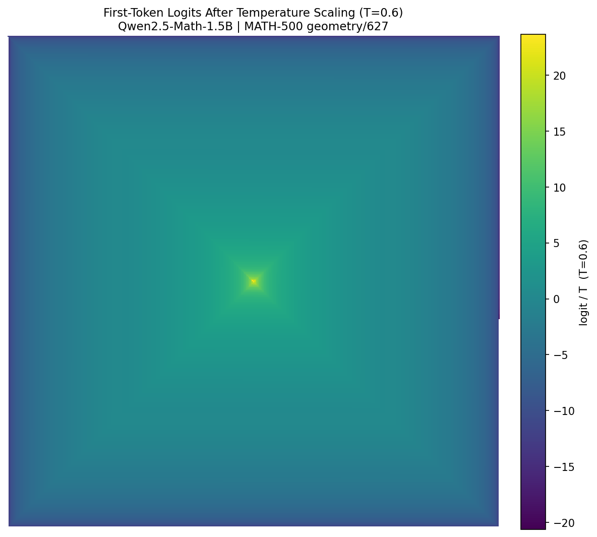
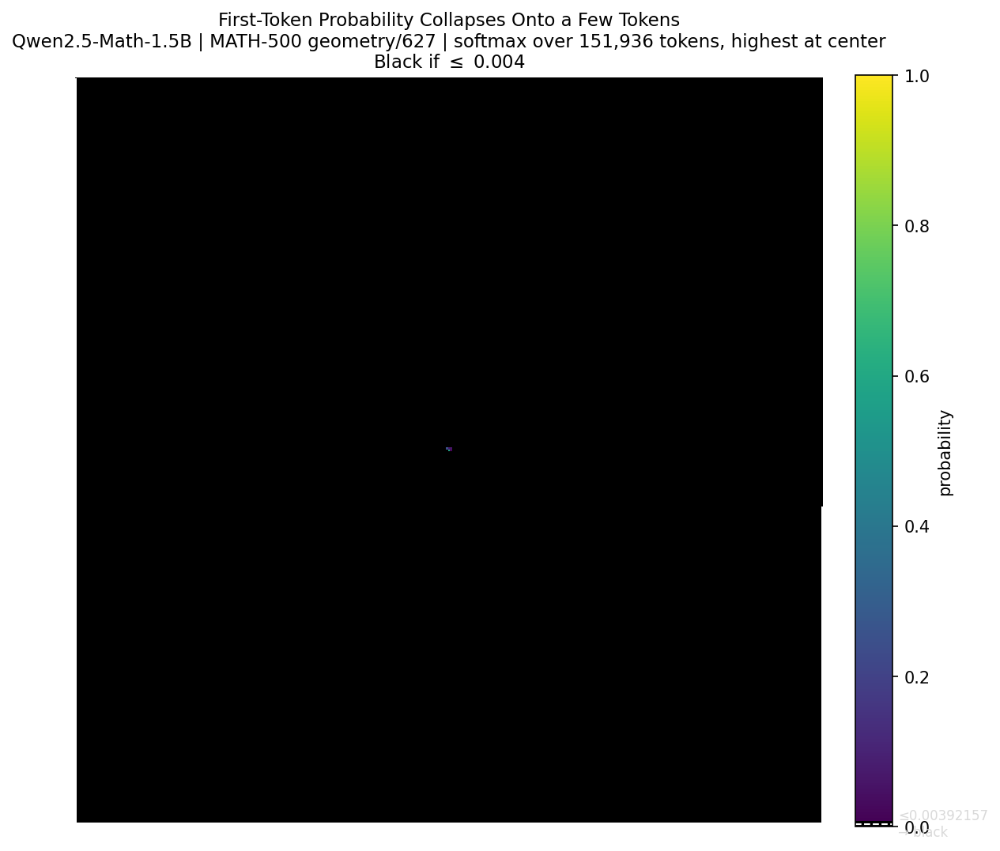
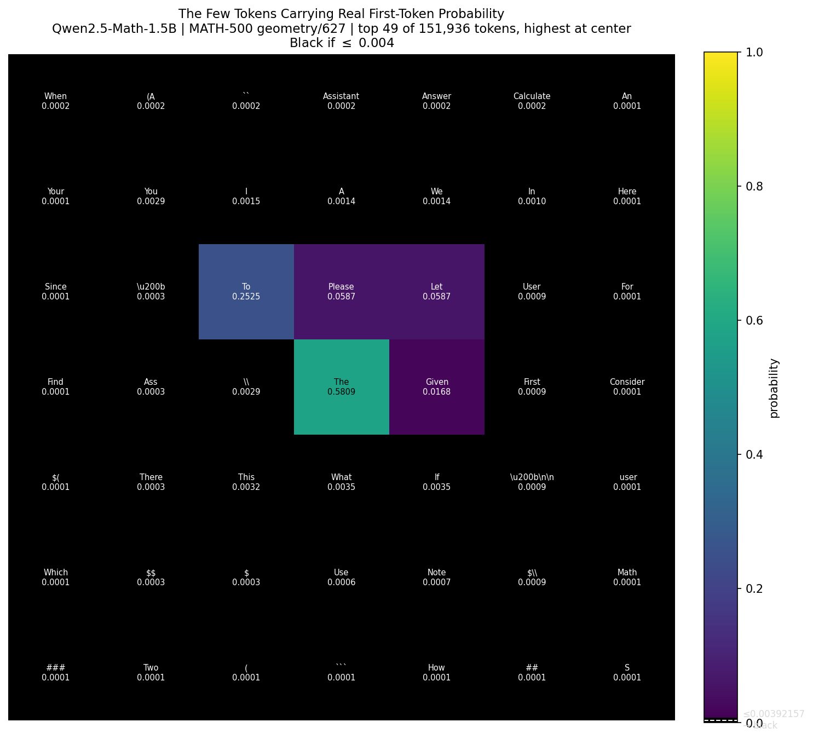
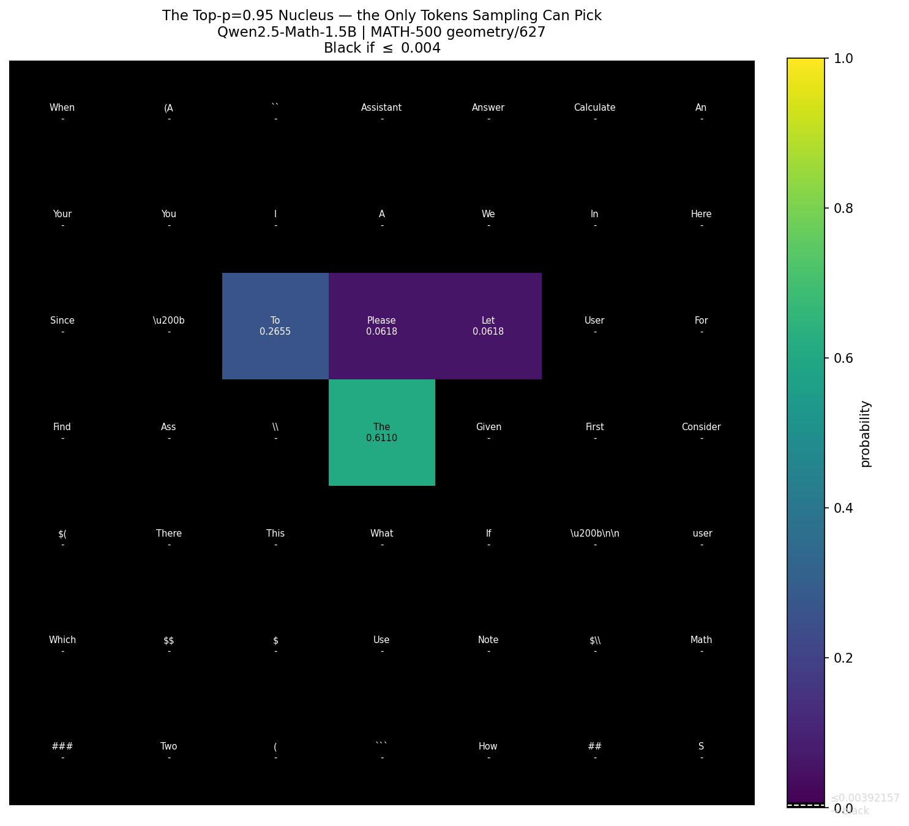

# Where Does a Language Model's First Token Come From?

When a language model answers a question, every token it produces starts as a
vote over its **entire vocabulary**. Qwen2.5-Math-1.5B has 151,936 tokens to
choose from. Before it writes a single character, it assigns a score to all
151,936 of them at once.

So what does that vote actually look like? We took one MATH-500 problem
(`geometry/627`), fed it through the model with the standard Qwen-Math chat
template, ran a single forward pass, and looked at the distribution over the
very first response token.

To see all 151,936 numbers at once, we lay them out in concentric square rings:
the highest-scoring token sits in the **center**, and tokens spiral outward in
rank order. The center is "most likely," the corners are "least likely." Color
encodes the value in each cell.

---

## 1. The raw logits: a smooth landscape

The model's raw output is a **logit** — one real number per token. Higher means
"more plausible here." Plotted across the whole vocabulary, the logits form a
smooth gradient: bright in the middle, fading gently toward the edges.



Nothing dramatic yet. Neighboring tokens have similar logits, and the surface
slopes gradually from the best token down to the worst. If you stopped here,
you might guess the model is fairly undecided — lots of tokens look "close."

That intuition is wrong, and the reason is what we do with these scores next.

## 2. Softmax: turning scores into probabilities

Logits aren't probabilities. They can be positive or negative, and they don't
add up to anything in particular. **Softmax** fixes that: it exponentiates every
score and divides by the total.

$$p_i = \frac{e^{z_i}}{\sum_j e^{z_j}}$$

Exponentiating makes every value positive, and dividing by the sum makes them
add to 1 — a valid probability distribution. But the exponential does something
more important than bookkeeping: it turns **additive** gaps between scores into
**multiplicative** ones.

Here's the whole trick in three lines. The constant `e ≈ 2.72`, and every time
the exponent goes up by 1, you multiply by another `e`:

```
e^1 = 2.72
e^2 = 2.72 × 2.72
e^3 = 2.72 × 2.72 × 2.72
```

So a token whose logit is just **1 point** higher than another isn't slightly
more likely — it's about **2.72×** more likely. Two points higher:
`2.72 × 2.72 ≈ 7.4×`. Ten points higher: over **22,000×**. A gently sloping
logit landscape, pushed through `e^x`, turns into a spike.

One more property worth noting: softmax only cares about the **differences**
between logits, not their absolute size. Adding the same constant to every logit
cancels out in the numerator and denominator. All that matters is how far each
token sits below the leader.

## 3. Temperature: widening (or narrowing) the gaps

Because only the gaps matter, we get a single knob for how decisive the model
is: divide every logit by a **temperature** `T` before the softmax.

Dividing by a number smaller than 1 makes everything bigger — and, crucially,
it stretches the **gaps**. Watch three logits at `T = 0.6`:

| logit | ÷ 0.6 |
|------:|------:|
| 15    | 25.00 |
| 10    | 16.67 |
| 5     | 8.33  |

The values 15 and 10 were 5 apart; after dividing by 0.6 they're 8.33 apart.
Every gap is multiplied by `1 / 0.6 ≈ 1.67`. Temperatures **below 1 sharpen**
the distribution (wider gaps, more decisive); temperatures **above 1 flatten**
it; `T = 1` changes nothing.



On the same linear color scale this looks almost identical to the raw logits —
dividing by a constant is just a rescale. The effect is invisible *here*. But
remember the previous section: softmax is about to exponentiate these gaps, and a
1.67× stretch in the gaps becomes an enormous swing in the final probabilities.

## 4. Put them together: the probability collapses

Apply softmax to the temperature-scaled logits — `softmax(logits / 0.6)` — and
that smooth landscape from step 1 collapses. Almost the entire vocabulary rounds
to a probability of zero, and a single token lights up dead center:



(In this plot anything below ~0.004 is floored to pure black, so the black sea
really is "essentially zero probability.")

Here are the top tokens. The `exp` column is `e^((zᵢ − z_max)/T)` — the
exponential measured *relative to the top token*. We subtract the max first
because the absolute exponentials are huge and only ratios matter (this is the
standard log-sum-exp trick). Divide any `exp` value by the total and you get the
probability.

| rank | token | logit | logit / 0.6 | exp (rel. to top) | probability | cumulative |
|-----:|:------|------:|------------:|------------------:|------------:|-----------:|
| 1 | `The`    | 14.19 | 23.65 | 1.0000 | 0.5809 | 0.5809 |
| 2 | `To`     | 13.69 | 22.81 | 0.4346 | 0.2525 | 0.8334 |
| 3 | `Please` | 12.81 | 21.35 | 0.1011 | 0.0587 | 0.8921 |
| 4 | `Let`    | 12.81 | 21.35 | 0.1011 | 0.0587 | **0.9509** |
| — | — | — | — | — | — | **← top-p = 0.95 cuts here** |
| 5 | `Given`  | 12.06 | 20.10 | 0.0290 | 0.0168 | 0.9677 |
| 6 | `If`     | 11.13 | 18.54 | 0.0061 | 0.0035 | 0.9712 |
| 7 | `What`   | 11.13 | 18.54 | 0.0061 | 0.0035 | 0.9747 |
| 8 | `This`   | 11.06 | 18.44 | 0.0055 | 0.0032 | 0.9779 |
| 9 | `\\`     | 11.00 | 18.33 | 0.0049 | 0.0029 | 0.9808 |
| 10 | `You`   | 11.00 | 18.33 | 0.0049 | 0.0029 | 0.9836 |

**Sum of `exp (rel. to top)` over all 151,936 tokens = 1.7214.** That single
number is the entire denominator of the softmax. Notice it's barely above 1.0 —
the top token alone contributes `1.0` of it, which is exactly why its
probability is `1.0 / 1.7214 = 0.5809`. The other 151,935 tokens *combined* add
only 0.72. The drop-off is brutal: by rank 6 the exponential has fallen by more
than 99% from the top, even though the logit only slipped from 14.19 to 11.13 —
a gap of just 3 points, turned into a ~165× difference by `e^(3/0.6)`.

## 5. The nucleus: four tokens out of 151,936

This is what makes **nucleus (top-p) sampling** work. Instead of considering all
151,936 tokens, top-p sampling keeps only the smallest set whose probabilities
add up to `p` (here 0.95) and samples from those.

Zooming into the bright center — the top 49 tokens, each labeled with its actual
softmax probability — shows how quickly the mass runs out:



The token in the dead center is **`The`**, at probability **0.5809** — by itself
more than half of everything. Ringed around it are the only other tokens with
any real weight.

Apply the top-p = 0.95 cutoff and almost all of them vanish. The cumulative
probability crosses 0.95 the instant `Let` is added (0.9509), so the nucleus is
exactly **four tokens** — `The`, `To`, `Please`, `Let`. `Given` and everything
else fall outside it and drop to black.

Sampling then **renormalizes within the nucleus** — it divides each surviving
probability by their sum (0.9509) so the four add back up to 1. That's the
distribution the model actually draws its first word from:



| token | softmax prob | renormalized (÷ 0.9509) |
|:------|-------------:|------------------------:|
| `The`    | 0.5809 | 0.6110 |
| `To`     | 0.2525 | 0.2655 |
| `Please` | 0.0587 | 0.0618 |
| `Let`    | 0.0587 | 0.0618 |

`The` ends up carrying **61%** of the nucleus, still parked in the center.

## Takeaway

The model scores 151,936 tokens on a smooth, almost continuous-looking scale.
But softmax runs those scores through `e^x`, which converts gentle additive
differences into violent multiplicative ones — and temperature `T < 1` widens
the gaps before they're exponentiated, making the spike sharper still. The result
is that essentially all of the probability piles onto a handful of tokens. After
a top-p = 0.95 filter the model's first word is really a choice among just
**four**, led by `The` at the center with 61% of the renormalized mass.

That extreme concentration is exactly what nucleus sampling is built to exploit:
most of the vocabulary was never in the running to begin with.
